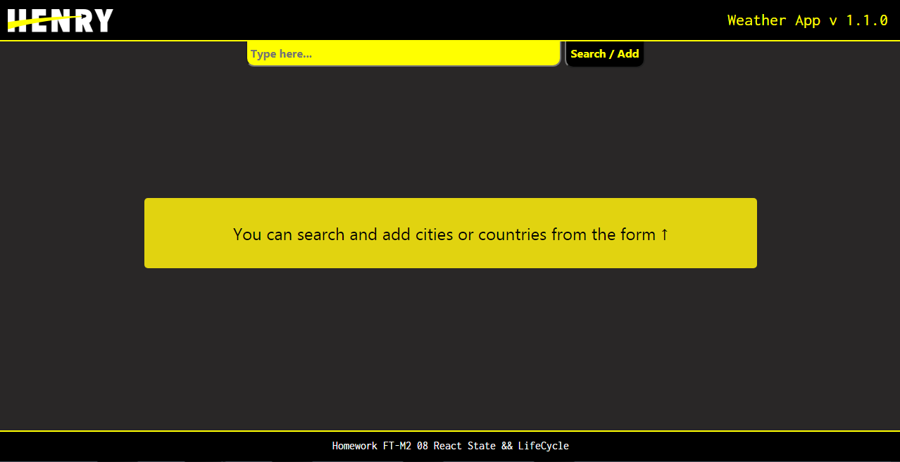
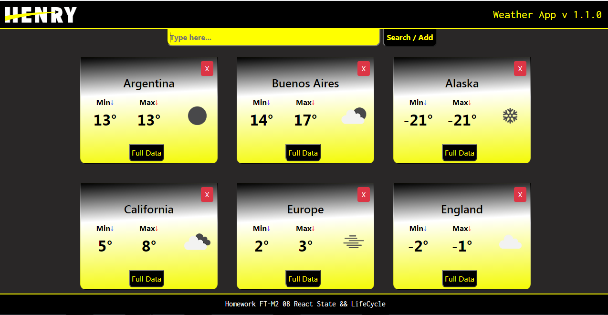

## Henry Weather APP / No paths only components 
### HOMEWORK
### Instrucciones para correr el proyecto

Desde la carpeta raíz "Climapp" se pueden ejecutar los siguientes comandos:

1. `npm install`: Instala todas las dependencias necesarias para correr el proyecto correctamente. [Es necesario correrlo sólo la primera vez]

2. `npm start`: Comienza a correr la aplicación de forma local por lo que se puede ver desde el navegador accediendo a http://localhost:3000

## [DEMO HERE](https://feli87.github.io/climapp/).

